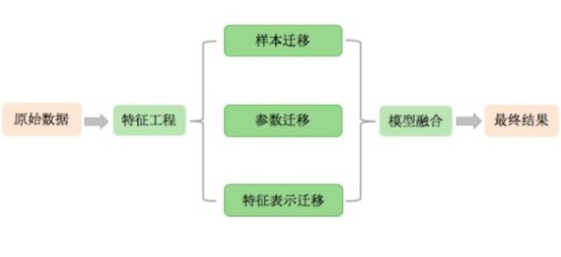
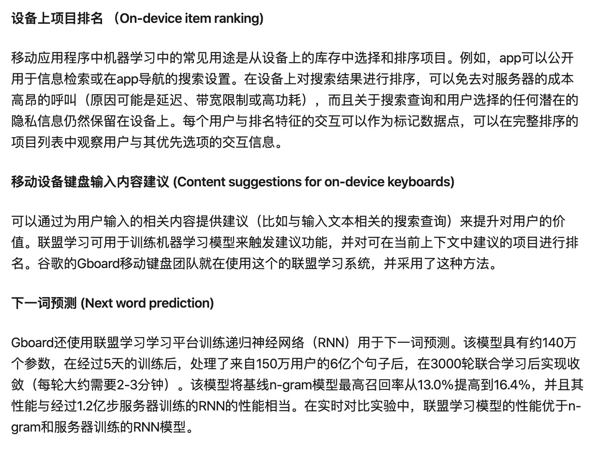

分布式NN -> 具体算法 -> 具体框架

同步训练
异步训练

Edge Intelligence: Paving the Last Mile of Artificial Intelligence With Edge Computing

1. Federated Learning  
Selective SGD(同步)
2. Aggregation Frequency Control
通信优化
3. Gradient Compression
技巧
4. DNN splitting
不符合场景(单独不可work)
5. Knowledge Transfer Learning  
teacher network
student network
6. GoSGD
卷积加速

master pac? 多个模型/一个模型 
slave 多个模型

联邦迁移学习/迁移学习

平台是基于框架

tensorflow federated

1）基于样本的迁移学习（instance-transfer）；
TrAdaBoost 
(不符合场景)

2）基于参数的迁移学习（parameter-transfer）；
multi-task learning

### 3）基于特征表示的迁移学习（feature-representation-transfer）；

4）基于关系知识的迁移（relational-knowledge-transfer）。 
知识图谱 markov logic network

### tensorflow federated
