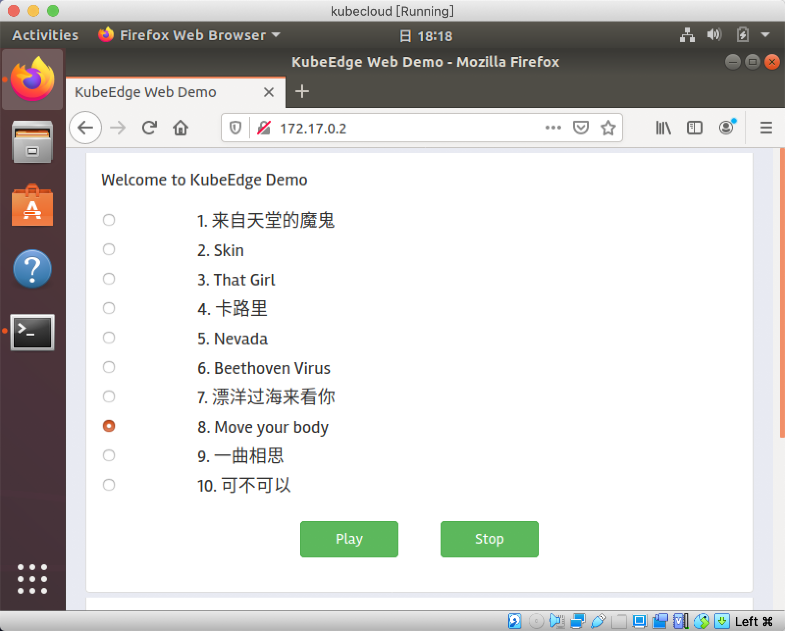

# Kubeedge安装,配置,HelloWorld

> 费尽千辛万苦,安装完了Kubeedge完成了云边通信.特此记录.

最终系统架构如下图:
```
MacOS(主机) -- VirtualBox 1 (Kubeedge Cloud)
            | -- Ubuntu18.04 IP:192.168.0.106 
            | -- Docker IP: 172.17.0.1
            | -- kindest/node:v1.17.2 Kubernetes Master IP: 172.17.0.2
            | -- kubeedge-web-app:v2.7 Kubernetes Pods 
           -- VirtualBox 2 (Kubeedge Edge)
            | -- Ubuntu18.04 IP: 192.168.0.105 
            | -- Docker IP: 172.17.0.1 
```

## 一. 基础安装环境
### 1. 下载Ubuntu18.04.4镜像
从 https://ubuntu.com/download/desktop 下载 `ubuntu-18.04.4-desktop-amd64.iso`
### 2. 下载并安装Virtual Box
### 3. 新建虚拟机

新建Ubuntu18.04.4虚拟机(1CPU, 4G, 10G), 进行系统安装. 建议选择最小化安装.

KubeEdge Cloud 10G硬盘空间可能不够, 自行Google Virtual Box硬盘扩容, 然后在Ubuntu中Resize系统盘大小.
### 4. 安装后关机,切换虚拟机网络设置为`Bridged Adapter` (`桥接模式`) 
### 5. 进入系统, 切换软件源为阿里源
### 6. 设置root密码
```bash
sudo passwd
```
### 7. 更新并升级软件源, 安装必要工具
```bash
sudo apt-get update 
sudo apt-get upgrade
sudo apt-get install net-tools make vim openssh-server docker.io
```
### 8. 检查安装

1. 运行 `sudo docker --version`  
   Docker version 19.03.6, build 369ce74a3c  
   **建议此时给docker配置一个阿里云加速**  
   资料: https://cr.console.aliyun.com/cn-hangzhou/instances/mirrors  
   先通过访问凭证登录, 再配置镜像加速器.  
2. 运行`ifconfig`  
   输出设备网络信息, **此时记录虚拟机IP**, 我的是`192.168.0.106`.

### 9. 打开ssh root登录

因为Kubernetes和Kubeedge都需要root权限, 因此以后尽量用root用户操作.  

```bash
sudo vim /etc/ssh/sshd_config
```
将`PermitRootLogin without-password`改为`PermitRootLogin yes`  

### 10. 安装snap包管理, 通过snap安装kubernetes三件套

```
sudo apt-get install snap
sudo snap install kubectl --classic
sudo snap install kubelet --classic
sudo snap install kubeadm --classic
```
### 11. 安装golang

  1. 从 https://golang.org/dl/ 下载 `go1.14.1.linux-amd64.tar.gz` .

      - 建议下载到主机, 然后通过scp拷贝到虚拟机.

      主机scp命令如下:

      ```
      ssh-keygen
      ssh-copy-id root@192.168.0.106
      scp ./go1.14.1.linux-amd64.tar.gz root@192.168.0.106:/root/
      ssh root@192.168.0.106
      ```

  2. 解压并且安装golang:

      ```bash
      su #切换用户为root
      tar -C /usr/ -xzf /root/go1.14.1.linux-amd64.tar.gz
      ```
      设置全局环境变量
      ```bash
      vim /etc/bash.bashrc
      ```
      在末尾添加

      ```bash 
      export PATH=$PATH:/snap/bin:/usr/go/bin
      export GOPATH=/root/go
      export GOBIN=$GOPATH/bin
      export PATH=$PATH:$GOBIN:$GOROOT/bin
      export GO111MODULE=auto
      ```
      运行
      ```bash
      source /etc/bash.bashrc
      ```

### 12. 修改虚拟机host文件访问github
- 资料: https://www.ioiox.com/archives/62.html

  1. 查询真实IP
     通过http://IPAddress.com 首页,输入`raw.githubusercontent.com`查询到真实IP地址

  2. 修改hosts

     ```bash
     sudo echo "你查到的IP raw.githubusercontent.com" >> /etc/hosts
     ```

### 13. 预下载kubeedge安装包

- 建议下载到主机, 然后通过scp拷贝到虚拟机.

从 https://github.com/kubeedge/kubeedge/releases 下载`kubeedge-v1.2.1-linux-amd64.tar.gz`
主机运行如下命令:

```bash
ssh root@192.168.0.106
mkdir -p /etc/kubeedge/
exit
scp ./kubeedge-v1.2.1-linux-amd64.tar.gz /etc/kubeedge/
```
### 14. 下载Kubeedge源码

- 建议下载到主机, 然后通过scp拷贝到虚拟机.

```bash
git clone https://github.com/kubeedge/kubeedge $GOPATH/src/github.com/kubeedge/kubeedge
```

### 15. 虚拟机克隆

1. 关闭虚拟机, clone(复制)一份同样的虚拟机, **`MAC地址设定`选择`为所有网卡生成重新mac地址`.**原虚拟机作为Cloud, 新复制的虚拟机作为Edge.
2. 在Edge上运行`ifconfig` 查看并记录IP. **我的IP为`192.168.0.105`**

## 二. 部署Kubeedge Cloud(192.168.0.106)
### 1. 编译Keadm

资料: http://docs.kubeedge.io/en/latest/setup/kubeedge_install_keadm.html

```bash
cd $GOPATH/src/github.com/kubeedge/kubeedge
make all WHAT=keadm
```
### 2. 安装keadm, 并拷贝到Edge虚拟机

   1. 安装keadm

      ```bash
      sudo cp ./_output/local/bin/keadm /usr/bin/
      ```
   2. 拷贝到Edge虚拟机

      ```bash
      ssh-keygen
      ssh-copy-id root@192.168.0.105
      scp ./_output/local/bin/keadm root@192.168.0.105:/usr/bin/
      ```
### 3. 下载kind, 部署kubernetes集群

资料: https://kind.sigs.k8s.io/docs/user/quick-start/

   1. 下载kind

      ```bash
      cd /root/
      GO111MODULE="on" go get sigs.k8s.io/kind@v0.7.0
      kind version
      #kind v0.7.0 go1.14.1 linux/amd64
      ```
   2. 手动下载kindest镜像
      ```bash
      docker pull kindest/node:v1.17.2
      ```
   2. 创建kind配置文件
      ```bash
      sudo tee /root/kind.yaml <<-'EOF'
      kind: Cluster
      apiVersion: kind.x-k8s.io/v1alpha4
      networking:
        apiServerAddress: "127.0.0.1"
        apiServerPort: 6443
      nodes:
        - role: control-plane
          image: kindest/node:v1.17.2
      EOF
      ```
3. 创建集群
      ```bash
      kind create cluster --config=/root/kind.yaml
      ```
4. 检查结果
    ```bash
    kubectl get nodes
    ```
    输出
    ```text
    NAME                 STATUS     ROLES    AGE   VERSION
    kind-control-plane   Ready      master   12s   v1.17.2
    ```
	创建集群成功
### 4. 创建kubeedge cloud节点

```bash
keadm init --kubeedge-version=1.2.1  --kube-config=/root/.kube/config
```

输出

```bash
Kubernetes version verification passed, KubeEdge installation will start...
Expected or Default KubeEdge version 1.2.1 is already downloaded
...
KubeEdge cloudcore is running, For logs visit:  /var/log/kubeedge/cloudcore.log
CloudCore started
```

查看日志 `tail -f /var/log/kubeedge/cloudcore.log`
### 5. 拷贝密钥到Edge虚拟机
```bash
scp -r /etc/kubeedge/certs root@192.168.0.105:/etc/kubeedge/
scp -r /etc/kubeedge/ca root@192.168.0.105:/etc/kubeedge/
```


## 三. 部署Kubeedge Edge(192.168.0.105)

### 1. 加入Kubeedeg集群
- 资料: http://docs.kubeedge.io/en/latest/setup/kubeedge_install_keadm.html

```bash
su #切换root用户
keadm join --cloudcore-ipport=192.168.0.106:10000 --edgenode-name=test1 --kubeedge-version=1.2.1
```
输出
```text
...
KubeEdge edgecore is running, For logs visit:  /var/log/kubeedge/edgecore.log
```
查看日志 `tail -f /var/log/kubeedge/edgecore.log`

```log
...
0405 16:37:40.870223    3769 process.go:622] get a message ...
I0405 16:37:40.874999    3769 proxy.go:318] [L4 Proxy] process other resource: kube-system/endpoints/kube-scheduler
I0405 16:37:40.887580    3769 process.go:117] received msg from cloud-hub:...
I0405 16:37:40.887993    3769 process.go:622] get a message ...
I0405 16:37:40.891567    3769 proxy.go:318] [L4 Proxy] process other resource: kube-system/endpoints/kube-controller-manager
...
```

## 四. Cloud 部署kubeedge-web-app

### 1. 确认集群状态
```
su #切换root用户
```
运行
```bash
kubectl get nodes
```
输出
```text
NAME                 STATUS   ROLES    AGE   VERSION
kind-control-plane   Ready    master   19h   v1.17.2
test1                Ready    edge     19h   v1.17.1-kubeedge-v1.2.1
```

运行
```bash
docker ps
```
输出
```text
CONTAINER ID        IMAGE                  COMMAND                  CREATED             STATUS              PORTS                      NAMES
309a72ab9dad        kindest/node:v1.17.2   "/usr/local/bin/entr…"   19 hours ago        Up 2 hours          127.0.0.1:6443->6443/tcp   kind-control-plane
```
### 2.下载编译example代码
- 建议scp

- 建议VS code remote

  1. 下载代码
  ```bash
  git clone https://github.com/kubeedge/examples $GOPATH/src/github.com/kubeedge/examples
  ```

  2. 构建基础镜像

  ```bash
  cd $GOPATH/src/github.com/kubeedge/examples
  cd kubeedge-web-demo/kubeedge-web-app/
  make all
  docker pull centos:7.6.1810
  docker build . -t kubeedge/kubeedge-web-app:v2.6
  ```

### 3.修改kubeedge-web-demo代码

**以下命令$GOPATH/src/github.com/kubeedge/examples/kubeedge-web-demo为根目录**

1. 修改Dockerfile代码

   文件:

   ```bash
   kubeedge-web-demo/kubeedge-web-app/Dockerfile
   ```

   修改结果:

   ```dockerfile
   # Based on centos
   FROM kubeedge/kubeedge-web-app:v2.6
   LABEL maintainers="KubeEdge Authors"
   LABEL description="KubeEdge Web App"
   
   # Copy from build directory
   COPY kubeedge-web-app /kubeedge-web-app
   COPY static /static
   COPY views /views
   
   # Update
   RUN yum -y update
   
   # Define default command
   ENTRYPOINT ["/kubeedge-web-app"]
   
   # Run the executable
   CMD ["kubeedge-web-app"]
   ```

2. 修改后端

   文件:

   ```bash
   kubeedge-web-demo/kubeedge-web-app/utils/kubeclient.go
   ```

   修改结果:

   ```go
   package utils
   
   import (
   	"errors"
   	"fmt"
   	"io/ioutil"
   	"k8s.io/client-go/rest"
   	certutil "k8s.io/client-go/util/cert"
   	"net"
   	"os"
   )
   
   var KubeQPS = float32(5.000000)
   var KubeBurst = 10
   var KubeContentType = "application/vnd.kubernetes.protobuf"
   var ErrNotInCluster = errors.New("unable to load in-cluster configuration, KUBERNETES_SERVICE_HOST and KUBERNETES_SERVICE_PORT must be defined")
   
   func InClusterConfig() (*rest.Config, error) {
   	const (
   		tokenFile  = "/var/run/secrets/kubernetes.io/serviceaccount/token"
   		rootCAFile = "/var/run/secrets/kubernetes.io/serviceaccount/ca.crt"
   	)
   	host, port := os.Getenv("KUBERNETES_SERVICE_HOST"), os.Getenv("KUBERNETES_SERVICE_PORT")
   	if len(host) == 0 || len(port) == 0 {
   		return nil, ErrNotInCluster
   	}
   
   	token, err := ioutil.ReadFile(tokenFile)
   	if err != nil {
   		return nil, err
   	}
   
   	tlsClientConfig := rest.TLSClientConfig{}
   
   	if _, err := certutil.NewPool(rootCAFile); err != nil {
   		fmt.Errorf("Expected to load root CA config from %s, but got err: %v", rootCAFile, err)
   	} else {
   		tlsClientConfig.CAFile = rootCAFile
   	}
   
   	return &rest.Config{
   		// TODO: switch to using cluster DNS.
   		Host:            "https://" + net.JoinHostPort(host, port),
   		TLSClientConfig: tlsClientConfig,
   		BearerToken:     string(token),
   	}, nil
   }
   
   // KubeConfig from flags
   func KubeConfig() (conf *rest.Config, err error) {
   	kubeConfig, err := InClusterConfig()
   	if err != nil {
   		return nil, err
   	}
   	kubeConfig.QPS = KubeQPS
   	kubeConfig.Burst = KubeBurst
   	kubeConfig.ContentType = KubeContentType
   	return kubeConfig, err
   }
   ```

3. 修改deployments

   文件:

   ```text
   kubeedge-web-demo/kubeedge-web-app/deployments/kubeedge-speaker-instance.yaml
   ```

   修改结果:

   ```yaml
   apiVersion: devices.kubeedge.io/v1alpha1
   kind: Device
   metadata:
     name: speaker-01
     labels:
       description: 'Speaker'
       manufacturer: 'test'
   spec:
     deviceModelRef:
       name: speaker-model
     nodeSelector:
       nodeSelectorTerms:
       - matchExpressions:
         - key: ''
           operator: In
           values:
           - test1
   ```

   文件:

   ```text
   kubeedge-web-demo/kubeedge-web-app/deployments/kubeedge-web-app.yaml
   ```

   修改结果:

   ```yaml
   apiVersion: apps/v1
   kind: Deployment
   metadata:
     labels:
       k8s-app: kubeedge-web-app
     name: kubeedge-web-app
     namespace: default
   spec:
     selector:
       matchLabels:
         k8s-app: kubeedge-web-app
     template:
       metadata:
         labels:
           k8s-app: kubeedge-web-app
       spec:
         nodeSelector:
           node-role.kubernetes.io/master: ""
         hostNetwork: true
         containers:
         - name: kubeedge-web-app
           image: kubeedge/kubeedge-web-app:v2.7
           imagePullPolicy: IfNotPresent
         restartPolicy: Always
   ```

   

### 4. 编译Docker镜像, 部署Deployment, 运行Pods

 1. 编译Docker镜像

    ```bash
    cd $GOPATH/src/github.com/kubeedge/examples
    cd kubeedge-web-demo/kubeedge-web-app/
    make clean && make all
    docker build . -t kubeedge/kubeedge-web-app:v2.7
    ```

    检查Docker镜像

    ```bash
    docker images
    ```

    输出

    ```
    REPOSITORY                  TAG                 IMAGE ID            CREATED             SIZE
    kubeedge/kubeedge-web-app   v2.7                e7e17d876279        21 hours ago        626MB
    kubeedge/kubeedge-web-app   v2.6                a78a95028de8        23 hours ago        488MB
    kindest/node                v1.17.2             df953f7b867a        8 weeks ago         1.25GB
    centos                      7.6.1810            f1cb7c7d58b7        12 months ago       202MB
    ```

	2. 修改集群用户权限

    资料:https://github.com/fabric8io/fabric8/issues/6840:

    创建资源文件:

    ```bash
    sudo tee /root/fabric8-rbac.yaml <<-'EOF'
    apiVersion: rbac.authorization.k8s.io/v1beta1
    kind: ClusterRoleBinding
    metadata:
      name: fabric8-rbac
    subjects:
      - kind: ServiceAccount
        # Reference to upper's `metadata.name`
        name: default
        # Reference to upper's `metadata.namespace`
        namespace: default
    roleRef:
      kind: ClusterRole
      name: cluster-admin
      apiGroup: rbac.authorization.k8s.io
    EOF
    ```

    部署资源文件:

    ```bash
    kubectl create -f /root/fabric8-rbac.yaml
    ```

	3. 部署Docker镜像为Deployments

    上传镜像到集群

    资料:https://kind.sigs.k8s.io/docs/user/known-issues/#unable-to-pull-images

    ```bash
    kind load docker-image kubeedge/kubeedge-web-app:v2.7
    ```

    部署

    ```bash
    cd $GOPATH/src/github.com/kubeedge/examples
    cd kubeedge-web-demo/kubeedge-web-app/deployments
    kubectl create -f kubeedge-speaker-model.yaml
    kubectl create -f kubeedge-speaker-instance.yaml
    kubectl create -f kubeedge-web-app.yaml
    ```

### 5.检查集群运行状态

```
$ kubectl get nodes
NAME                 STATUS   ROLES    AGE   VERSION
kind-control-plane   Ready    master   20h   v1.17.2
test1                Ready    edge     20h   v1.17.1-kubeedge-v1.2.1
```

```bash
$ docker ps
CONTAINER ID        IMAGE                  COMMAND                  CREATED             STATUS              PORTS                      NAMES
309a72ab9dad        kindest/node:v1.17.2   "/usr/local/bin/entr…"   21 hours ago        Up 7 minutes        127.0.0.1:6443->6443/tcp   kind-control-plane
```

```bash
$ kubectl get crds
NAME                                           CREATED AT
clusterobjectsyncs.reliablesyncs.kubeedge.io   2020-04-04T13:25:40Z
devicemodels.devices.kubeedge.io               2020-04-04T13:25:40Z
devices.devices.kubeedge.io                    2020-04-04T13:25:39Z
objectsyncs.reliablesyncs.kubeedge.io          2020-04-04T13:25:40Z
```

```bash
$ kubectl get deployments
NAME               READY   UP-TO-DATE   AVAILABLE   AGE
kubeedge-web-app   1/1     1            1           20h
```

```bash
$ kubectl get pods
NAME                                READY   STATUS    RESTARTS   AGE
kubeedge-web-app-76d4755f59-f5zbr   1/1     Running   2          20h
```

```bash
$ kubectl describe pod kubeedge-web-app-76d4755f59-f5zbr | grep IP
IP:           172.17.0.2
IPs:
  IP:           172.17.0.2
```

在Cloud上访问上一步得到的IP, 可以看到如下网页, 网页不用关:


## 五.Edge(192.168.0.105) 部署客户端程序监听mqtt消息

在Edge(192.168.0.105)端创建此程序

```bash
su #切换为root用户
cd /root/
touch /root/main.go
```

/root/main.go

```go
package main

import (
	"encoding/json"
	"fmt"
	"github.com/kubeedge/kubeedge/cloud/pkg/devicecontroller/types"
	"github.com/yosssi/gmq/mqtt"
	"github.com/yosssi/gmq/mqtt/client"
)

func main() {
	fmt.Println("Get music list successfully")

	cli := client.New(&client.Options{
		// Define the processing of the error handler.
		ErrorHandler: func(err error) {
			fmt.Println(err)
		},
	})

	fmt.Println("Create mqtt client successfully")

	stopchan := make(chan int)
	// Terminate the Client.
	defer cli.Terminate()

	// Connect to the MQTT Server.
	err := cli.Connect(&client.ConnectOptions{
		Network:  "tcp",
		Address:  "localhost:1883",
		ClientID: []byte("receive-client"),
	})
	if err != nil {
		panic(err)
	}
	fmt.Println("Connect mqtt client successfully")

	err = cli.Subscribe(&client.SubscribeOptions{
		SubReqs: []*client.SubReq{
			{
				TopicFilter: []byte(`$hw/events/device/speaker-01/twin/update/document`),
				QoS:         mqtt.QoS0,
				// Define the processing of the message handler.
				Handler: func(topicName, message []byte) {
					Update := &types.DeviceTwinDocument{}
					err := json.Unmarshal(message, Update)
					if err != nil {
						fmt.Println("Unmarshal error", err)
						fmt.Printf("Unmarshal error: %v\n", err)
					}
					fmt.Printf("%+v", Update)
				},
			},
		},
	})
	fmt.Println("Subscribe mqtt topic successfully")

	<-stopchan
	if err != nil {
		panic(err)
	} else {
		fmt.Println("Connection successfully")
	}
}
```

运行此程序

```bash
go get github.com/yosssi/gmq/mqtt/client
go get github.com/yosssi/gmq/mqtt
go run /root/main.go
```

输出

```
Get music list successfully
Create mqtt client successfully
Connect mqtt client successfully
Subscribe mqtt topic successfully
```

## 六. 查看运行效果

查看运行效果需要同时打开如下几个应用(终端建议VS Code Remote):

Cloud上:

1. pod日志终端

   ```bash
   kubectl logs -f kubeedge-web-app-76d4755f59-f5zbr
   ```

2. 网页`172.17.0.2`

Edge上:

1. Kubeedge日志

   ```bash
   tail -f /var/log/kubeedge/edgecore.log
   ```

2. MQTT客户端程序

   ```bash
   go run main.go
   ```


选中6号歌曲歌曲, 点击网页`Play`按钮, 依次产生如下结果:

Cloud上:

```bash
$ kubectl logs -f kubeedge-web-app-76d4755f59-f5zbr
2020/04/05 10:35:34 PlayTrack: 6
2020/04/05 10:35:34 Track [ 6 ] will be played on speaker speaker-01
```
Edge上:
```bash
$ tail -f /var/log/kubeedge/edgecore.log
I0405 18:37:47.912391    5635 eventbus.go:88] Success in pubMQTT with topic: $hw/events/device/speaker-01/twin/update/document
I0405 18:37:47.912567    5635 eventbus.go:88] Success in pubMQTT with topic: $hw/events/device/speaker-01/twin/update/delta
```

```bash
$ go run main.go
Get music list successfully
Create mqtt client successfully
Connect mqtt client successfully
Subscribe mqtt topic successfully
&{BaseMessage:{EventID: Timestamp:1586082823422} Twin:map[track:0xc000012d90]}&{BaseMessage:{EventID:307710b5-ef50-48be-abbd-f39ff079b42c Timestamp:1586082934968} Twin:map[track:0xc000012e50]}
```

如果在Edge上安装`sqlite3`还可以看到Kubeedge把消息存到数据库中.

```bash
$ apt-get install sqlite3
$ cat /etc/kubeedge/config/edgecore.yaml | grep datasource
datasource: /var/lib/kubeedge/edgecore.db
$ sqlite3 /var/lib/kubeedge/edgecore.db
SQLite version 3.22.0 2018-01-22 18:45:57
Enter ".help" for usage hints.
sqlite> .tables
device       device_attr  device_twin  meta       
sqlite> .header on
sqlite> .mode column
sqlite> SELECT * FROM device_twin;
id          deviceid    name        description  expected    actual      expected_meta                actual_meta  expected_version           actual_version  optional    attr_type   metadata  
----------  ----------  ----------  -----------  ----------  ----------  ---------------------------  -----------  -------------------------  --------------  ----------  ----------  ----------
4           speaker-01  track                    6                       {"timestamp":1586083067906}               {"cloud":106581,"edge":0}                  0           string      {}        
```

至此, 可以证明Kubeedge Cloud和Kubeedge Edge完成了通信.


## 参考资料:

[1] 修改default账户权限 https://github.com/kubernetes/client-go/blob/8e91b7aa91b1ac2ad5d144bd602f01d7daa7d187/rest/config.go#L451

[2] 从pod访问Kubernetes API https://kubernetes.io/docs/tasks/access-application-cluster/access-cluster/#accessing-the-api-from-a-pod

[3] kubectl代理 https://kubernetes.io/docs/reference/generated/kubectl/kubectl-commands#proxy

[4] linux ssh root登录 https://www.cnblogs.com/toughlife/p/5633510.html

[5] paho mqtt client https://www.eclipse.org/paho/clients/golang/

[6] kubeedge examples https://github.com/kubeedge/examples

[7] 使用kind创建集群 https://kind.sigs.k8s.io/docs/user/quick-start/

[8] kind load docker-image https://kind.sigs.k8s.io/docs/user/known-issues/#unable-to-pull-images

[9] 自定义kubernetes资源 https://kubernetes.io/docs/tasks/access-kubernetes-api/custom-resources/custom-resource-definitions/#advanced-topics

[10] 阿里云容器镜像加速服务 https://cr.console.aliyun.com/cn-hangzhou/instances/mirrors

[11] k8s进入容器方法 https://blog.csdn.net/aa1215018028/article/details/81205691

[12] kubeedge安装文档 http://docs.kubeedge.io/en/latest/setup/kubeedge_install_keadm.html

[13] Kubernetes apiserver源码分析 https://github.com/fabric8io/fabric8/issues/6840

[14] https://githubusercontent.com.ipaddress.com/raw.githubusercontent.com

[15] Kubernetes概念 https://kubernetes.io/docs/concepts/architecture/nodes/

[16] 安装golang https://golang.org/doc/install?download=go1.14.1.linux-amd64.tar.gz

[17] sqlite3操作 https://www.runoob.com/sqlite/sqlite-select.html

